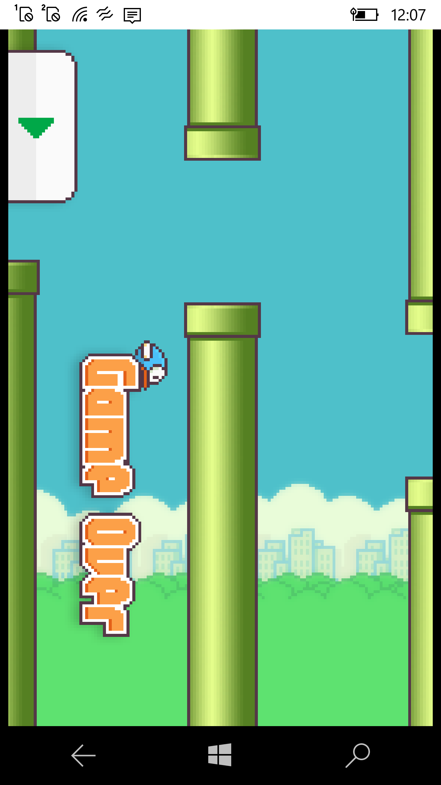

# FlappyBirdUNO

My fork of [FlappyBird](https://github.com/mattleibow/FlappyBird) repo. The main goal to adapt the code to .NET 1.4 standard / Xamarin Forms 2.5 .

## About
The "official" FlappyBird clone - made with SkiaSharp

## Screenshot(s)

## Status
- NET Standard 1.4
- WIn10/11 Desktop/Mobile (UWP; min.os. build 15063; touch control works 50/50)
- Game process not complete
- Some strange bugs with coordinate (X, Y) detections -- wrong scaling & offset:))))
- No sound
- FPS counter disabled (Developers, you can switch it on again if you can)

## Architecture
It is built with a few technologies:
 - UWP "multi-platforming"
 - SkiaSharp 1.60 (All attempts to use 1.68/2.40 failed)
 - Xamarin.Forms 2.5
 - Uno-compatible projects remained for future deals :)

## Used "workbench"
- Visual Studio 2017 on my old Surface Pro 4 
- Microsoft Lumia 950 and new power/data cord (with "soft skin/cover" :)))

## References
- https://github.com/mattleibow/FlappyBird The "offical" UNO clone of FlappyBird 
- https://github.com/mattleibow  Main Developer of FlappyBird clone, Uno/XF edition 

## . 
AS IS. No support. RnD only / DIY

## ..
[m]edia[e]xmplorer 2022